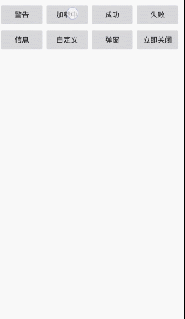
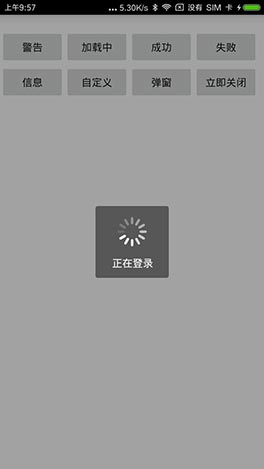

# Android-PromptDialog
提示窗口，正在加载中，确认对话框,非组合控件，自定义ImageView实现，感谢star



#### 1、添加依赖

```
allprojects {
    repositories {
        ...
        maven { url 'https://jitpack.io' }
    }
}


```

```
dependencies {
    ...
    compile 'com.github.limxing:Android-PromptDialog:1.0.2'
}

```
#### 2、创建对象及使用方法
```
promptDialog = new PromptDialog(this);
promptDialog.showLoading("正在登录");
/**
promptDialog.showSuccess("登陆成功");
promptDialog.showError("登录失败");
promptDialog.showWarn("注意");
promptDialog.showInfo("成功了");
promptDialog.showCustom(R.mipmap.ic_launcher, "自定义图标的");
promptDialog.dismiss();
promptDialog.dismissImmediately();


        confirm.setTextColor(Color.parseColor("#DAA520"));
 //按钮的定义
        PromptButton confirm = new PromptButton("确定", new PromptButtonListener() {
            @Override
            public void onClick(PromptButton button) {
                Toast.makeText(MainActivity.this, button.getText(), Toast.LENGTH_SHORT).show();
            }
        });
        confirm.setFocusBacColor(Color.parseColor("#FAFAD2"));
        promptDialog.showWarnAlert("你确定要退出登录？", new PromptButton("取消", new PromptButtonListener() {
                    @Override
                    public void onClick(PromptButton button) {
                        Toast.makeText(MainActivity.this, button.getText(), Toast.LENGTH_SHORT).show();
                    }
          }), confirm);
**/
```
#### 3、自定义窗口style
```
//自定义提示框Style
promptDialog.getDefaultBuilder().touchAble(true).round(3)..
//自定义弹窗对话框Style
promptDialog.getAlertDefaultBuilder().touchAble(false).round(5)...
```
#### 4、按需处理返回键
```
  @Override
    public void onBackPressed() {
        if (promptDialog.onBackPressed())
            super.onBackPressed();
    }
```
#### License
Copyright  2017 Limxing

Licensed under the Apache License, Version 2.0 (the "License");
you may not use this file except in compliance with the License.
You may obtain a copy of the License at

   http://www.apache.org/licenses/LICENSE-2.0

Unless required by applicable law or agreed to in writing, software
distributed under the License is distributed on an "AS IS" BASIS,
WITHOUT WARRANTIES OR CONDITIONS OF ANY KIND, either express or implied.
See the License for the specific language governing permissions and
limitations under the License.
