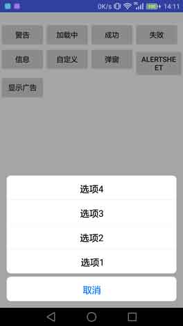

# Android-PromptDialog
提示窗口，正在加载中，确认对话框,广告展示，底部Sheet选项，非组合控件，感谢star  



[](https://jitpack.io/#limxing/Android-PromptDialog)

#### 1、添加依赖

```
allprojects {
    repositories {
        ...
        maven { url 'https://jitpack.io' }
    }
}


```

```
dependencies {
    ...
    compile 'com.github.limxing:Android-PromptDialog:1.1.2'
}

```
#### 2、创建对象及使用方法
```
promptDialog = new PromptDialog(this);
promptDialog.showLoading("正在登录");
/**
/********************消息提示框*************/
promptDialog.showSuccess("登陆成功");
promptDialog.showError("登录失败");
promptDialog.showWarn("注意");
promptDialog.showInfo("成功了");
promptDialog.showCustom(R.mipmap.ic_launcher, "自定义图标的");
promptDialog.dismiss();
promptDialog.dismissImmediately();

/********************Alert弹窗*************/
final PromptButton confirm = new PromptButton("确定", new PromptButtonListener() {
   @Override
   public void onClick(PromptButton button) {
       Toast.makeText(MainActivity.this, button.getText(), Toast.LENGTH_SHORT).show();
   }
});
confirm.setTextColor(Color.parseColor("#DAA520"));
//按钮的定义
PromptButton confirm = new PromptButton("确定", new PromptButtonListener() {
    @Override
    public void onClick(PromptButton button) {
        Toast.makeText(MainActivity.this, button.getText(), Toast.LENGTH_SHORT).show();
    }
});
confirm.setFocusBacColor(Color.parseColor("#FAFAD2"));
//Alert的调用
promptDialog.showWarnAlert("你确定要退出登录？", new PromptButton("取消", new PromptButtonListener() {
            @Override
            public void onClick(PromptButton button) {
                Toast.makeText(MainActivity.this, button.getText(), Toast.LENGTH_SHORT).show();
            }
  }), confirm);
  
/********************底部AlertSheet*************/
//可创建android效果的底部Sheet选择，默认IOS效果，sheetCellPad=0为Android效果的Sheet
//                promptDialog.getAlertDefaultBuilder().sheetCellPad(0).round(0);
//设置按钮的特点，颜色大小什么的，具体看PromptButton的成员变量
PromptButton cancle = new PromptButton("取消", null);
cancle.setTextColor(Color.parseColor("#0076ff"));
//设置显示的文字大小及颜色
//promptDialog.getAlertDefaultBuilder().textSize(12).textColor(Color.GRAY);
//默认两个按钮为Alert对话框，大于三个按钮的为底部SHeet形式展现
promptDialog.showAlertSheet("", true, cancle,
  new PromptButton("选项1", null), new PromptButton("选项2", null),
  new PromptButton("选项3", null), new PromptButton("选项4", null));
 /********************展示广告的方法*************/
 promptDialog.getDefaultBuilder().backAlpha(150);
Glide.with(MainActivity.this).load("https://timgsa.baidu.com/timg?image&quality=80&" +
        "size=b9999_10000&sec=1495518782659&di=25b120262114749ae8543652d2de5715&" +
        "imgtype=0&src=http%3A%2F%2Fimg.tupianzj.com%2Fuploads%2Fallimg%2F160316%2F9-160316152R5.jpg")
        .into(promptDialog.showAd(true, new OnAdClickListener() {
            @Override
            public void onAdClick() {
                Toast.makeText(MainActivity.this,"点击了广告",Toast.LENGTH_SHORT).show();
            }
        }));
**/
```
#### 3、自定义窗口style
```
/* 均为单例，设置一次后会影响另一个，因此如果效果不同那么调用前设置一次*/
//自定义提示框Style，适应于show...（消息提示框，展示广告）
promptDialog.getDefaultBuilder().touchAble(true).round(3).loadingDuration(3000)..
//自定义弹窗对话框Style，适应于Alert 及AlertSheet（Alert弹窗，底部AlertSheet）
promptDialog.getAlertDefaultBuilder().touchAble(false).round(5)...
```
#### 4、按需处理返回键
```
  //返回键的处理仅是Alert 或AlertSheet的关闭操作
  @Override
    public void onBackPressed() {
        if (promptDialog.onBackPressed())
            super.onBackPressed();
    }
```
#### License

```
Copyright  2017 Limxing

Licensed under the Apache License, Version 2.0 (the "License");
you may not use this file except in compliance with the License.
You may obtain a copy of the License at

   http://www.apache.org/licenses/LICENSE-2.0

Unless required by applicable law or agreed to in writing, software
distributed under the License is distributed on an "AS IS" BASIS,
WITHOUT WARRANTIES OR CONDITIONS OF ANY KIND, either express or implied.
See the License for the specific language governing permissions and
limitations under the License.
```